# File Server & NTFS Permission – thatccna.isa

## 🎯 Mục tiêu
Triển khai File Server nội bộ và phân quyền truy cập dữ liệu theo phòng ban trong domain **thatccna.isa**.

---

## 🧱 Mô hình LAB
- Domain: thatccna.isa
- File Server: Windows Server
- Ip: 192.168.189.20
- DNS: 192.168.289.10 (DC)
- Client: Windows 10 (domain member)

---

## ⚙️ Các bước triển khai

### 1️⃣ Join File Server vào Domain
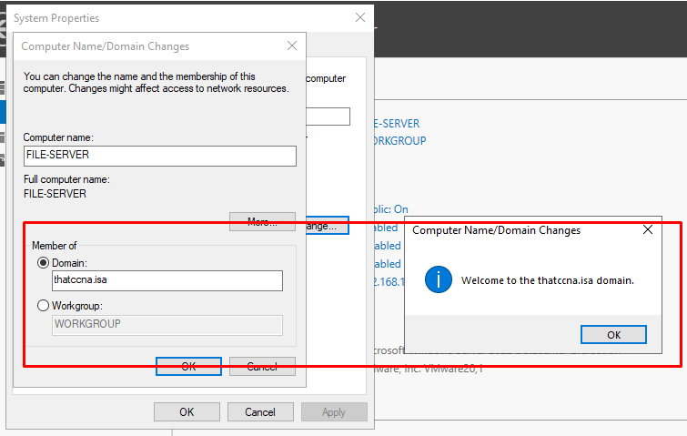

---

### 2️⃣ Tạo cấu trúc thư mục phòng ban
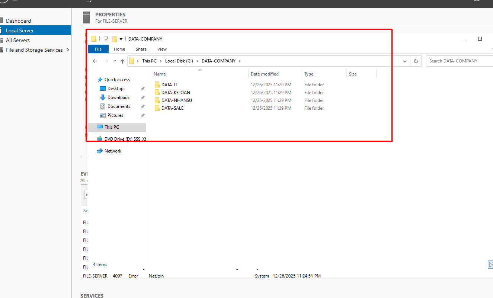

---

### 3️⃣ Tạo Group trong Active Directory

#### OU / Group phòng Nhân sự
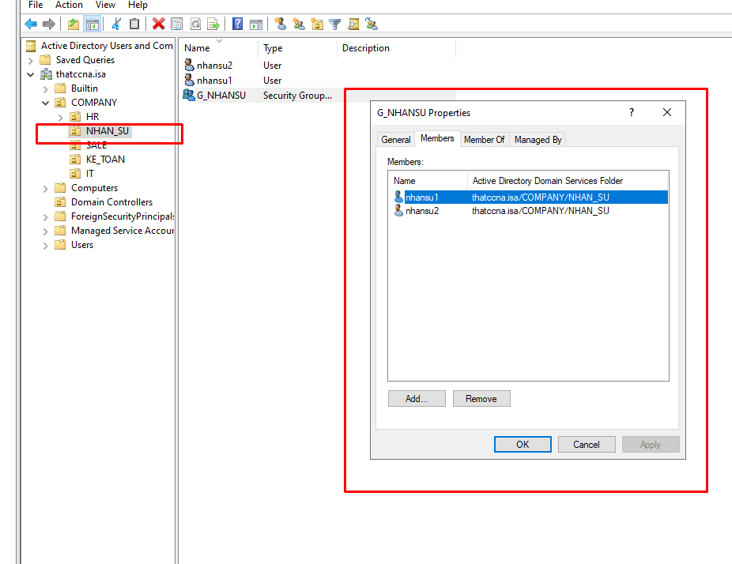

#### OU / Group phòng Kế toán
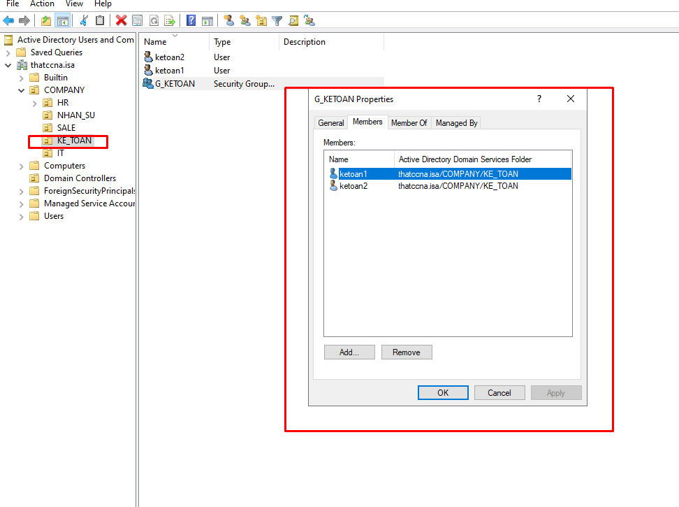

#### OU / Group phòng Sale

#### OU / Group phòng IT

---

### 4️⃣ Phân quyền NTFS theo Group

#### NTFS – Phòng Nhân sự
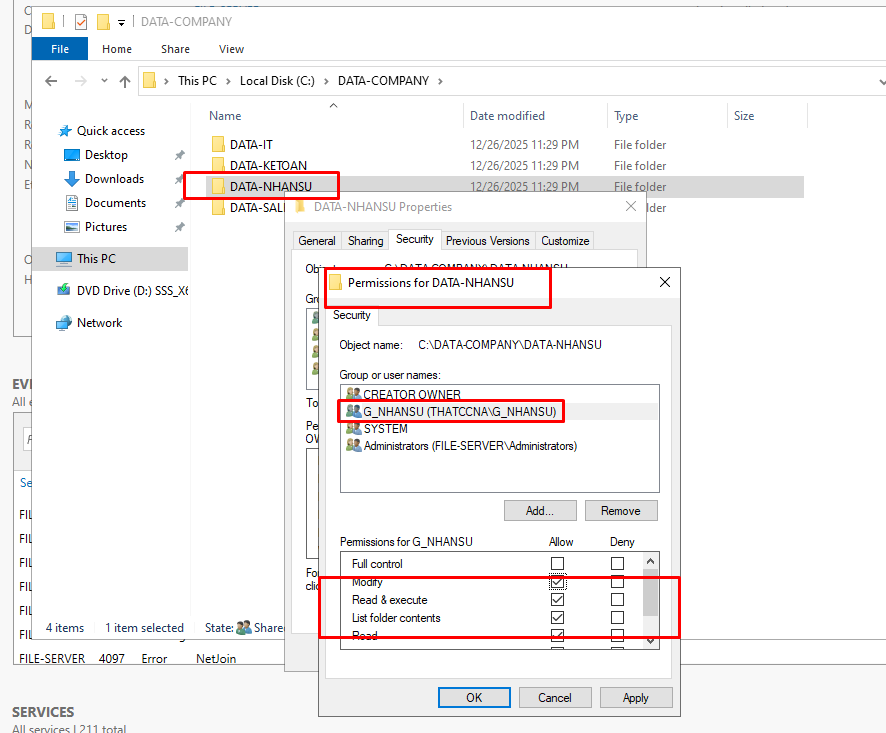

#### NTFS – Phòng Kế toán
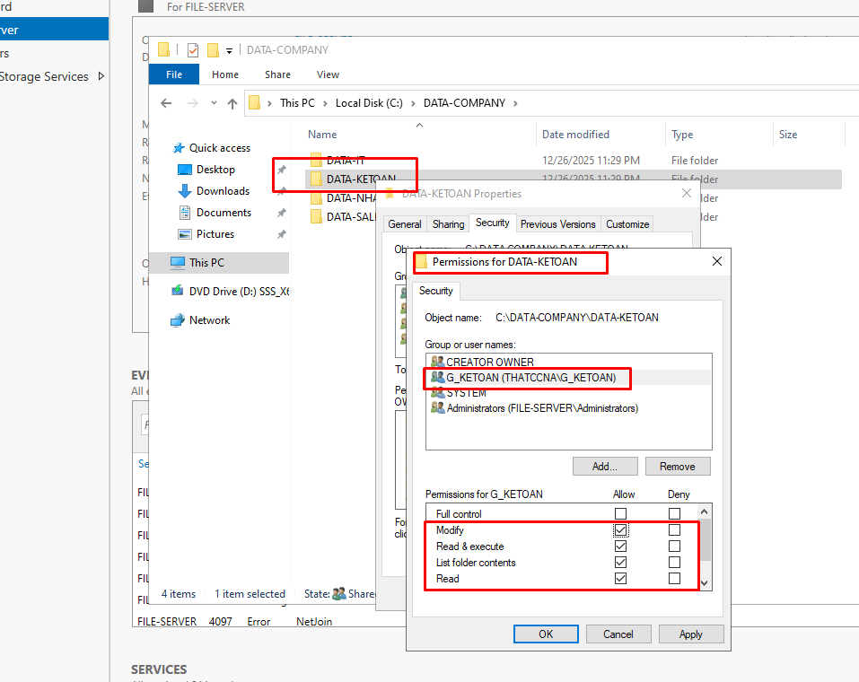

#### NTFS – Phòng Sale
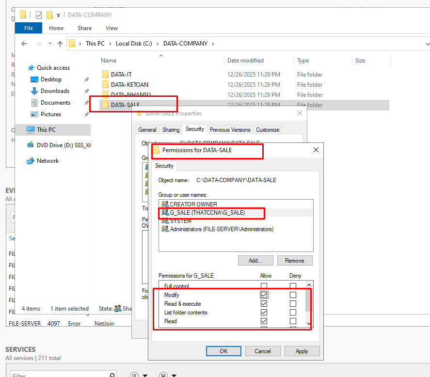

#### NTFS – Phòng IT
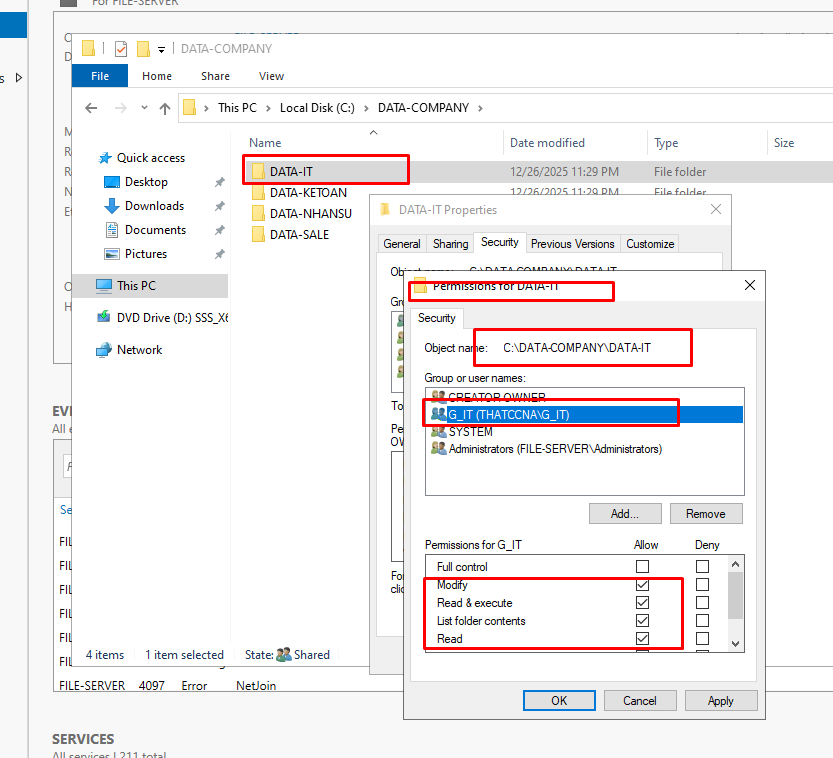

---

### 5️⃣ Share Folder
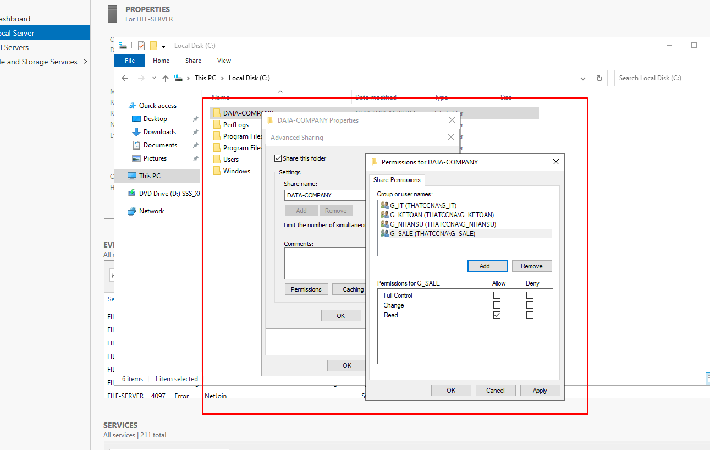

---

### 6️⃣ Test truy cập từ máy Client

#### Truy cập đúng quyền
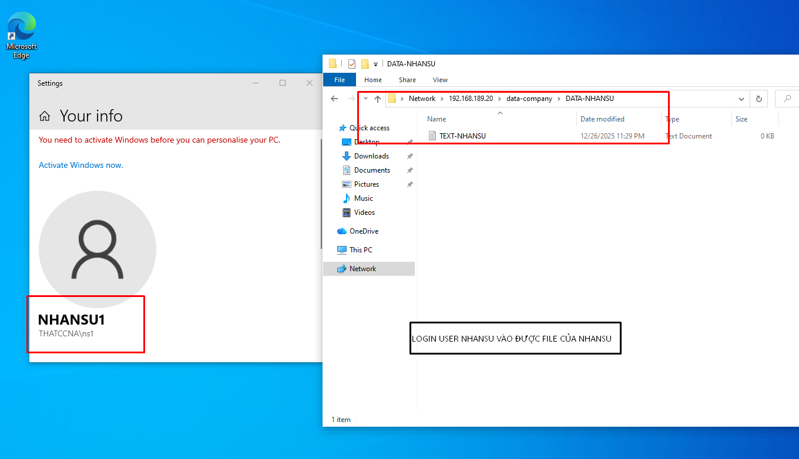

#### Truy cập sai quyền
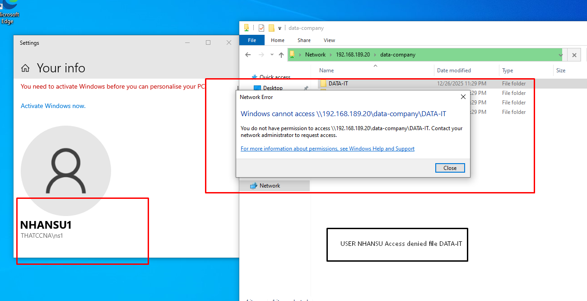

---

## ✅ Kết quả
- User đăng nhập domain chỉ truy cập được thư mục đúng phòng ban
- Phân quyền được quản lý bằng **Active Directory Group + NTFS**
